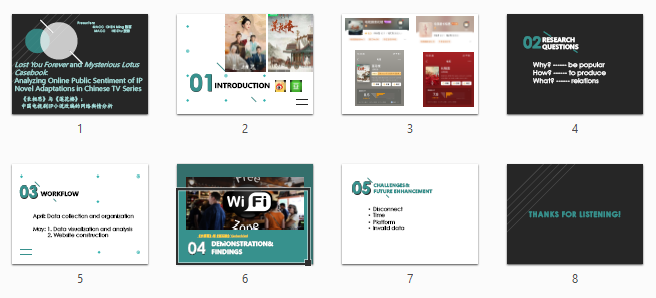

# Group Project for HUMA5630 Digital Humanities

| Student Name | UID | UST email | Github username |
| ------------ | --- | --------- | --------------- |
| CHEN Ming    | 21011741 |mchenci@connect.ust.hk| [@mchenci](https://github.com/mchenci) |
| HE Shu       | 21035371 |shebh@connect.ust.hk  | [@Shebhu](https://github.com/Shebhu)  |

# Topic
Lost You Forever and Mysterious Lotus Casebook: Analyzing Online Public Sentiment of IP Novel Adaptations in Chinese TV series

# URL
https://huma5630-digital-humanities.github.io/project-2024-group-4/%E6%88%90%E6%9E%9C%E5%B1%95%E7%A4%BA%E7%BD%91%E7%AB%99%EF%BC%88%E7%82%B9%E5%BC%80index)/index.html

# Presentation Slides
[PPT version](https://github.com/HUMA5630-Digital-Humanities/project-2024-group-4/blob/main/pre%20and%20report/pre.pptx) | [PDF version](https://github.com/HUMA5630-Digital-Humanities/project-2024-group-4/blob/main/pre.pdf)

# Report
[PDF version](https://github.com/HUMA5630-Digital-Humanities/project-2024-group-4/blob/main/pre%20and%20report/CHEN%20Ming%26HE%20Shu-DH%20report.pdf)
